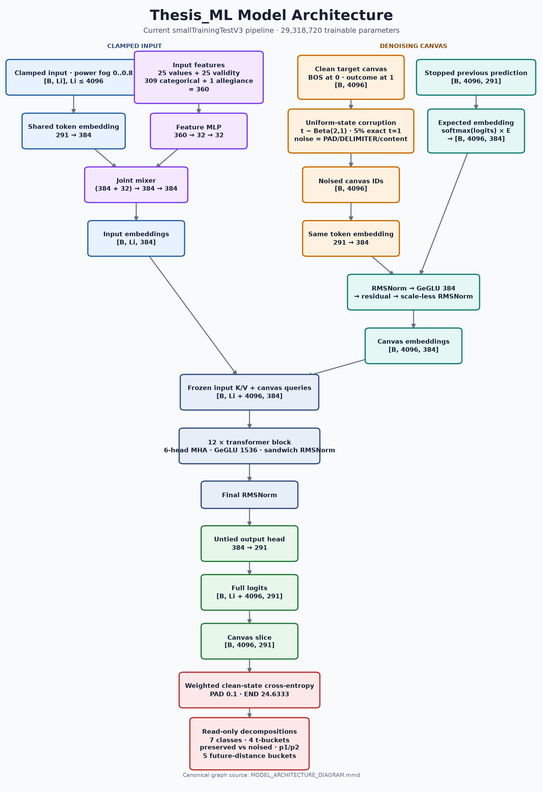

# Thesis_ML Current Model Architecture

## Scope and authority

This document is the exact implementation-and-configuration companion to `SPEC.md`. `SPEC.md` remains the normative design authority; this file records the current learnable machinery, model-facing plumbing, tensor sizes, parameter counts, training objective, and inference procedure implemented by the repository.

Unless a section explicitly says otherwise, exact run-profile values refer to the merged `configs/smallTrainingTestV3.yaml` full-corpus profile. Values are derived from the loaded configuration, the live vocabulary, the configured feature-statistics artifact, and direct `SC2StrategyDiffusionModel` construction—not from an older checkpoint or console log.

## Architecture at a glance

- Model family: dense uniform-state discrete-diffusion transformer with frozen input K/V conditioning.
- Trainable parameters: **29,318,720**.
- Model width: **384**.
- Transformer blocks: **12**.
- Attention: **6** heads × **64** dimensions per head.
- Dense GeGLU width: **1,536**.
- Vocabulary tensor width: **291** IDs.
- Local-full batch size: **9**.
- Input budget: at most **4,096** served tokens per row.
- Canvas size: exactly **4,096** target tokens per row in the production builders.
- Maximum concatenated model sequence: **8,192** positions.
- Output: one untied, bias-free **384 → 291** token head at every concatenated position; training slices the canvas region and excludes its clamped BOS anchor from loss.
- Position encoding: parameter-free Llama 3.1-style frequency-scaled RoPE.
- No encoder-decoder split, cross-attention, causal mask, learned positional embedding, region/segment embedding, copy head, classification head, or explicit diffusion-time embedding.
- Frozen input K/V is the promoted default and is `true` in V3; segment embeddings and per-segment positions remain disabled ablations. The active identity is `dense-multinomial-SC2-v2+frozen_input_kv`.

## End-to-end data flow



The directly viewable artifacts are [`MODEL_ARCHITECTURE_DIAGRAM.png`](MODEL_ARCHITECTURE_DIAGRAM.png) and [`MODEL_ARCHITECTURE_DIAGRAM.svg`](MODEL_ARCHITECTURE_DIAGRAM.svg). The single canonical graph definition is [`MODEL_ARCHITECTURE_DIAGRAM.mmd`](MODEL_ARCHITECTURE_DIAGRAM.mmd); `render_diagram.py` reads it and regenerates both images without requiring Mermaid CLI or a browser.

## Exact smallTrainingTestV3 configuration

| Property | Current value |
|---|---:|
| `model.d_model` | 384 |
| `model.layers` | 12 |
| `model.heads` | 6 |
| Derived head dimension | 64 |
| `model.ffn` | 1,536 |
| Model dropout used by the production constructor | 0.0 |
| `model.qk_norm` | true |
| `model.self_conditioning` | true |
| `model.gradient_checkpointing` | true |
| `model.frozen_input_kv` | true |
| `model.segment_embeddings` | false |
| `model.per_segment_positions` | false |
| Derived `architecture_identity` | `dense-multinomial-SC2-v2+frozen_input_kv` |
| `model.rope_theta` | 500,000 |
| RoPE type | `llama3` |
| RoPE factor | 8.0 |
| RoPE low/high frequency factors | 1.0 / 4.0 |
| RoPE original context | 8,192 |
| `data.input_budget_tokens` | 4,096 |
| `data.canvas_budget_tokens` | 4,096 |
| `data.canvas_recon_fraction` | 0.5 |
| Derived reconstruction limit | 2,048 tokens |
| `pipeline.batch_size` | 9 |
| `diffusion.process` | `uniform` |
| Diffusion time distribution | `Beta(2,1)`, implemented as `U**0.5` over `[0,1]` |
| Exact-`t=1` oversampling | 0.05 |
| Enemy omission distribution | scaled `Beta(2,1)` over `[0,0.8]` |
| Peak learning rate | 3e-4 |
| AdamW betas | 0.9, 0.95 |
| AdamW epsilon | 1e-8 |
| Weight decay | 0.1 |
| LR schedule | WSD: 10% warmup / 70% stable / 20% linear decay |
| LR floor | 0.01 × peak = 3e-6 |
| Gradient clipping | 1.0 |
| Accumulation steps | 5 |
| Effective-token accumulation target | disabled (`0`) |
| Epochs | 50 maximum; dev-loss early stopping patience 10 |
| Checkpoints | resume every 100 optimizer steps; best-dev per improved epoch; durable every 5 epochs |
| EMA decay | derived per run; ceiling 0.9999 |
| EMA horizon ratio | 0.1 × the run's total optimizer steps |
| Training self-conditioning probability | 0.5 per row |
| Compute precision | BF16 autocast |
| Stored parameter dtype | FP32 |
| Sampler maximum passes | 64 |
| Sampler temperature | linear 0.8 → 0.4 |
| Entropy bound | 0.1 |
| Adaptive entropy threshold | 0.005 |
| Required stable passes | 2 |

`train.max_steps: 0` is resolved by the pipeline to `ceil(len(train_loader) / accumulation_steps) × train.epochs` before the scheduler is constructed. With the current 4,763 training batches per epoch, V3 plans 953 optimizer steps per epoch and 47,650 over 50 epochs. That resolved optimizer-step horizon drives both the learning-rate schedule and EMA window.

The default `wsd` multiplier uses exactly 4,765 warmup, 33,355 stable, and 9,530 decay optimizer steps at the current horizon. The LR rises linearly to `3e-4`, remains there for 70% of training, then decays linearly to `3e-6` over the final 20%. `train.lr_schedule` can also select the legacy `cosine` or `linear` post-warmup schedules; historical profiles pin those choices explicitly.

## Vocabulary and learned state space

### Token identities

| ID range | Meaning | Count |
|---|---|---:|
| 0 | `[MASK]` | 1 |
| 1 | `[PAD]` | 1 |
| 2 | `[END]` | 1 |
| 3 | `[DELIMITER]` | 1 |
| 4 | `[WIN]` | 1 |
| 5 | `[LOSS]` | 1 |
| 6 | `[BOS]` | 1 |
| 7 | `[EOS]` | 1 |
| 8–290 | contiguous content-token IDs | 283 |

The vocabulary width is the largest assigned token ID plus one:

\[
V = 290 + 1 = 291.
\]

All 291 embedding/output rows are named special or content tokens; there is no reserved-ID hole. Uniform prior, corruption, and re-noising draw uniformly from 285 states: `[PAD]`, `[DELIMITER]`, and the 283 content IDs. They never inject `[MASK]`, `[END]`, `[WIN]`, `[LOSS]`, `[BOS]`, or `[EOS]`. Clean-token candidate sampling masks only `[MASK]`, so the output head can still predict legitimate target specials.

### Shared token embedding

\[
E \in \mathbb{R}^{291 \times 384}
\]

The same table embeds clamped input IDs, noised canvas IDs, and the expected token distribution used by self-conditioning. It is not tied to the output head.

## Clamped input and feature conditioning

### Input token sequence

For each one-second replay timestep, the served input grammar is:

```text
[self content records]
[fog-filtered enemy content records]
[one DELIMITER]
[one EOS after the final timestep]
```

One fog rate is sampled per served example as `0.8 × U**0.5`, a scaled `Beta(2,1)` draw. This preserves the complete `0.0–0.8` range but favors strong omission: 43.75% of draws are at least 0.6, while 6.25% are below 0.2. Each enemy content token is independently omitted with that probability. Fog does not insert `[MASK]`; self records, delimiters, and the terminal `[EOS]` remain. Persisted artifacts remain clean. EOS counts against the 4,096-token input budget.

The collator left-pads each row to the longest served input in its batch:

| Tensor | Shape | Dtype |
|---|---|---|
| `input_token_ids` | `[B, Li]`, `Li ≤ 4096` | int64 |
| `input_attention_mask` | `[B, Li]` | bool |
| `input_lengths` | `[B]` | int64 |

Because fog is applied after clean-window selection, the served `Li` can be below the clean 4,096-token window budget.

### Model-facing feature tensors

| Tensor | Shape | Dtype | Meaning |
|---|---|---|---|
| `continuous_values` | `[B, Li, 25]` | float32 | approved scalar features |
| `continuous_validity` | `[B, Li, 25]` | bool | valid zero versus missing |
| `categorical_values` | `[B, Li, 309]` | float32 | cloak and buff encodings |
| `allegiance_values` | `[B, Li, 1]` | float32 | self `+1`, enemy `-1`, structural `0` |
| `feature_mask` | `[B, Li]` | bool | true only for content records |

The 25 continuous channels are:

```text
map_x, map_y, health, energy, shields,
facing_sin, facing_cos, radius, build_progress,
weapon_cooldown, attack_upgrade_level, armor_upgrade_level,
shield_upgrade_level, cargo_space_taken, cargo_space_max,
order_count, is_flying, is_burrowed, is_hallucination,
is_active, is_powered, ideal_harvesters,
buff_duration_remain, buff_duration_max, detect_range
```

The categorical width is:

- 5 cloak-state one-hot channels;
- 1 buff-validity channel;
- 303 buff-ID multi-hot channels for raw IDs 0–302.

The learnable branch input width is therefore:

\[
25_{values} + 25_{validity} + 309_{categorical} + 1_{allegiance} = 360.
\]

Valid continuous features are standardized using 25 non-trainable train-split means and standard deviations. Invalid standardized values are replaced by zero. Absolute time, frame number, `game_loop`, and timestamp-derived values do not enter any model-facing feature tensor.

### Feature MLP and joint mixer

The feature network is:

\[
360 \xrightarrow{Linear+ReLU} 32 \xrightarrow{Linear+ReLU} 32.
\]

The result is concatenated with the 384-dimensional token embedding and mixed by:

\[
(384 + 32) = 416 \xrightarrow{Linear+GELU} 384 \xrightarrow{Linear} 384.
\]

The final joint-mixer projection is reset to exactly zero after generic model initialization. Initially, the input path therefore equals token lookup exactly. The learned residual is multiplied by `feature_mask`, so delimiters and batch padding receive no feature residual.

## Canvas construction and corruption

### Clean target canvas

The production pretraining builder emits exactly 4,096 tokens:

```text
[BOS] [perspective-relative WIN or LOSS]
(enemy timestep content [DELIMITER])*
[END] [PAD]*                  # when game end fits
or
[PAD]*                        # when horizon is boundary-truncated
```

Position 0 is always `[BOS]`; it is attended but permanently clamped and unscored. Position 1 is always the outcome token and remains ordinarily corrupted, predicted, re-noised, and scored. The body first reconstructs the enemy sequence overlapping the input window, then continues into enemy-future timesteps. In-window enemy reconstruction is bounded by `4096 × 0.5 = 2048` tokens; the remaining budget carries the two-token prefix, future continuation, delimiters, end token, and semantic padding.

| Tensor | Shape | Dtype |
|---|---|---|
| `target_canvas` | `[B, 4096]` | int64 |
| `canvas_attention_mask` | `[B, 4096]` | bool |
| `class_labels` | `[B, 4096]` | int64 |
| `canvas_loss_mask` | `[B, 4096]` | bool |
| `canvas_prediction_distances` | `[B, 4096]` | int64 |

Semantic `[PAD]` is a real attended and scored target. Clamped BOS and extra padding introduced to batch differently sized examples are excluded from loss; BOS remains included in attention. The current production builders fill their canvas budget, so every produced canvas row is 4,096 positions, of which 4,095 are loss-eligible.

### Uniform corruption

For every batch row, the continuous component samples one scalar:

\[
t_b = U_b^{1/2}, \quad U_b \sim Uniform(0,1).
\]

This is `Beta(2,1)`: 43.75% of continuous draws satisfy `t>=0.75`, while 6.25% satisfy `t<0.25`. An independent branch forces exactly `t=1` for 5% of examples. Every loss-eligible canvas position independently enters the corruption branch with probability `t_b`. Selected positions are replaced uniformly with `[PAD]`, `[DELIMITER]`, or one of 283 content IDs; the replacement can equal the clean target. `[WIN]`/`[LOSS]` at position 1 are eligible for replacement even though neither token is in the replacement support. The EOS-terminated input and canvas position-0 BOS are returned unchanged.

The model does not receive `t_b` as a scalar, embedding, token, or feature. It must infer the current noise level from the noised canvas itself.

The absorbing scientific ablation replaces selected positions with `[MASK]` and changes the scored mask/position weighting; it does not change the model parameterization.

## Expected-embedding self-conditioning

Given prior canvas logits

\[
Z \in \mathbb{R}^{B \times 4096 \times 291},
\]

the stopped expected token embedding is:

\[
P = softmax(Z), \qquad S = stopgrad(P)\;stopgrad(E),
\]

with

\[
S \in \mathbb{R}^{B \times 4096 \times 384}.
\]

The canvas conditioning branch is:

```text
S
→ learned RMSNorm(384)
→ GeGLU gate/up/down, all width 384
→ add to ordinary canvas token embedding
→ scale-less RMSNorm
```

When no signal is supplied, the branch uses zeros, but the ordinary canvas embedding still passes through the scale-less post-add RMSNorm.

Training performs a no-gradient estimate pass for the entire batch, samples an independent Bernoulli mask with probability 0.5 per row, zeros the conditioning signal for unselected rows, and then performs the loss-bearing pass. Validation through the explicit evaluation-model path does not sample this training branch.

Inference reuses the preceding denoising pass's temperature-shaped probability distribution, so normal self-conditioned inference does not add an extra forward pass.

## Concatenated transformer input

Input and canvas embeddings are concatenated rather than passed through separate encoder and decoder stacks:

\[
X_0 = [X_{input}; X_{canvas}]
\in \mathbb{R}^{B \times (L_i + 4096) \times 384}.
\]

For a maximum-size V3 batch:

\[
X_0 \in \mathbb{R}^{9 \times 8192 \times 384}.
\]

The combined boolean mask is `[input_attention_mask; canvas_attention_mask]`. Attention is fully bidirectional and non-causal. The mask is a broadcast key mask shaped internally as `[B, 1, 1, L]`; it masks invalid keys, not query computation. Input logits and padded-query hidden states may be computed, but only canvas positions enter the loss.

There is no learned input/canvas region embedding. Region identity is expressed indirectly through feature residual availability, self-conditioning on the canvas, token grammar, and concatenated position. The `model.segment_embeddings` toggle exists to make that identity explicit and is `false` in every committed profile; see "Architecture ablation toggles".

## Transformer backbone

### RoPE

Each attention layer owns a parameter-free Llama 3.1-style frequency-scaled rotary module configured with:

- head dimension 64;
- 32 inverse frequencies;
- base `theta = 500,000`;
- scaling factor 8;
- low/high frequency factors 1 and 4;
- original context 8,192.

The 32-element inverse-frequency tensor is a non-persistent FP32 buffer in each of the 12 layers. RoPE can evaluate arbitrary sequence lengths and contains no learned position parameters; 8,192 is the configured scaling reference and current maximum budget-derived length, not a hard implementation cap.

Positions are `arange(L_i + 4096)` over the concatenated sequence, shared by every batch row, producing `cos`/`sin` of shape `[L, 64]`. Rotary phases therefore encode only relative offsets `i - j`; the model receives no absolute index. The `model.per_segment_positions` toggle replaces the shared `arange` with explicit per-example position ids and is `false` in every committed profile; see "Architecture ablation toggles".

### One transformer block

Each of the 12 blocks applies:

```text
x
→ learned pre-attention RMSNorm
→ dense multi-head self-attention
→ learned post-attention RMSNorm
→ residual add
→ learned pre-FFN RMSNorm
→ dense GeGLU FFN
→ learned post-FFN RMSNorm
→ residual add
```

All RMSNorms use epsilon `1e-6`. This is sandwich normalization: each residual branch is normalized both before its transformation and after the branch transformation, before addition.

### Attention shapes

For hidden state `[B, L, 384]`:

1. One bias-free `384 → 1152` projection produces QKV.
2. It reshapes to `[B, L, 3, 6, 64]`.
3. Q, K, and V become `[B, 6, L, 64]`.
4. Q and K each pass through a learned 64-element RMSNorm shared across the six heads.
5. RoPE rotates Q and K.
6. PyTorch scaled-dot-product attention uses the default scale `1/sqrt(64) = 1/8`, the broadcast key mask, and `is_causal=False`.
7. Heads merge back to `[B, L, 384]` and pass through a bias-free `384 → 384` output projection.

This is vanilla multi-head attention, not grouped-query or multi-query attention. CUDA execution permits Flash Attention and memory-efficient SDPA only; the quadratic math fallback is forbidden.

### Dense GeGLU

The bias-free FFN is:

\[
g = GELU_{tanh}(W_gx), \qquad u = W_ux,
\]

\[
FFN(x) = W_d(g \odot u),
\]

where gate and up project `384 → 1536` and down projects `1536 → 384`.

### Gradient checkpointing

The V3 profile checkpoints each transformer block while training. This changes activation storage and recomputation, but does not change model outputs, parameter shapes, or parameter counts.

## Architecture ablation toggles

Three independent boolean fields on `ModelConfig` control how the input region and the canvas region relate to each other. They exist so an ablation can isolate why the position-pinned rare classes fail to fit; the motivating failure analysis is `diagnostics/009-rare-class-position-blindness.md` and the implementation interface is `diagnostics/009-ablation-toggle-interface-map.md`.

`frozen_input_kv` is `true` in the default and V3 profile. `segment_embeddings` and `per_segment_positions` are false. Frozen input K/V adds no parameters, so the active V3 model remains 29,318,720 parameters and stamps `dense-multinomial-SC2-v2+frozen_input_kv`.

`configs/local_overfit_v2.yaml` is the ablation control surface: exactly one flag is flipped there per arm.

Each toggle is read once in `SC2StrategyDiffusionModel.__init__` and handed to the subsystem that owns it: `segment_embeddings` to `InputContextEmbedding`, `frozen_input_kv` to `BidirectionalTransformer`, and `per_segment_positions` to a plain `self.per_segment_positions` attribute so `forward` never reaches back into the config object at step time.

### `model.frozen_input_kv`

Splits the single joint bidirectional forward into two passes.

1. Pass 1 runs the input region alone through all 12 blocks, attending only to itself, capturing each layer's post-RoPE, post-QK-norm input `K` and `V` as `[B, 6, L_i, 64]` pairs.
2. Pass 2 runs the canvas region through all 12 blocks, where at layer `l` canvas queries attend to `concat(cached_input_K[l], canvas_K)` and the matching `V`. The key mask is the full combined `[B, 1, 1, L_i + 4096]` broadcast key mask; the query axis is 4,096.

This is a real semantic change: input hidden states stop depending on the canvas, which they do in the joint stack. The payoff is inference cost — the input KV is computed once and reused across the remaining denoising passes rather than recomputed per pass. See "Sampling machinery" for how the sampler exploits it and for the measured per-step speedup.

`SC2StrategyDiffusionModel.forward` exposes the cache through three additions, all defaulted so every historical call site is unchanged: `cached_input_kv: FrozenInputKV | None`, `return_cached_input_kv: bool`, and a `cached_input_kv` field on `ModelOutput` populated only when the cache was requested. `FrozenInputKV` carries one `(K, V)` pair per block plus the input region's own pre-`final_norm` hidden states, so a cache-reusing forward still emits full-length output rather than padding the input half with zeros.

Requesting or supplying a cache while the ablation is off, or with an empty input region, raises `ValueError` in the backbone; it never silently degrades to the joint path.

Adds **zero parameters** and zero `state_dict` keys. The backbone still returns a full-length `[B, L_i + 4096, 384]` hidden state; the input half is concatenated back on before the final RMSNorm so every downstream `logits[:, L_i:, :]` slice stays valid.

### `model.segment_embeddings`

Adds a learned `nn.Embedding(2, 384)` — row `0` = input segment, row `1` = canvas segment — to the **final** per-region embedding inside `InputContextEmbedding`, after the joint feature residual on the input side and after the scale-less self-conditioning post-norm on the canvas side, so the term is not renormalized away.

The table is zero-initialized by `InputContextEmbedding.reset_segment_embeddings()`, which `SC2StrategyDiffusionModel.__init__` calls immediately after `reset_joint_output()` and for the same reason: the generic `_init_weights` sweep re-initializes every `nn.Embedding` at `std = 0.02` and would otherwise leave the table non-zero. At zero the segment term adds nothing, so day-0 behavior with the toggle enabled matches the baseline exactly and any later divergence is attributable to learning rather than to initialization noise. The reset is unconditional and is a no-op when the toggle is off.

When the toggle is off the module is not constructed at all — the attribute holds a plain `None`, which `nn.Module` does not register — so **no extra `state_dict` keys appear**. Architecture-v2 checkpoints from the matching arm load strictly.

This is the only one of the three that adds parameters. When enabled on V3 it adds `2 × 384 = 768` trainable parameters, taking the whole-model total to 29,319,488.

### `model.per_segment_positions`

Computes RoPE position ids **per segment** instead of as one `arange` over the concatenated sequence. The module-level helper `_build_per_segment_position_ids` in `src/thesis_ml/model/model.py` returns a `[B, L_i + 4096]` long tensor in which:

- input real content receives `0 … L-1` in its left-padded slots, by subtracting the row's `input_len - input_lengths[i]` offset from an `arange`; the left-pad slots go negative and are `clamp_min(0)`-ed. Pinning them to `0` is deliberate rather than incidental — those slots are excluded from attention as keys and their logits are never scored, so their rotation is unobservable, but it must still be defined;
- the canvas restarts at `0` at canvas index 0.

`input_lengths` reaches `forward` by either of two routes that are identically equal by construction: a caller holding `batch.input_lengths` passes it explicitly, and a caller that does not gets it derived as `attention_mask[:, :input_len].sum(dim=1)`. The collater sets exactly `input_lengths` mask entries True per row, so the choice is a micro-optimization and cannot change an output value.

Positions therefore become **per-example**, so `RotaryEmbedding.forward` returns `cos`/`sin` of shape `[B, L, 64]` instead of `[L, 64]`, and `apply_rope` dispatches on that rank difference. The baseline branch is retained verbatim (`torch.arange` + `torch.outer`), and the batched broadcast multiply on the new branch was verified bitwise-identical to `torch.outer` on the 1-D case, so the toggle-off numerics are unchanged.

Adds **zero parameters** and zero `state_dict` keys. RoPE remains parameter-free.

Note that per-segment positions **alias** the two regions onto the same relative offsets, so this toggle is designed to compose with `model.segment_embeddings`, which is what re-disambiguates them.

### Derived `architecture_identity` and checkpoint compatibility

`toggle_fingerprint(model_config)` in `src/thesis_ml/config.py` returns the empty string when all three toggles are false, otherwise an alphabetically sorted `+`-joined suffix of the enabled field names, for example `+frozen_input_kv+per_segment_positions`. `SC2StrategyDiffusionModel.__init__` stamps:

```python
self.architecture_identity = ARCHITECTURE_ID + toggle_fingerprint(model_config)
```

With the V3/default toggle set this is `dense-multinomial-SC2-v2+frozen_input_kv`. Vocabulary-v1 checkpoints are intentionally retired because their embedding/head widths and canvas grammar differ. `validate_checkpoint_compatibility` compares the stamp before reading weights, so v1 checkpoints and checkpoints from a different v2 toggle set cannot resume, warm-start, sample, or feed diagnostics.

**This gating is necessary rather than defensive.** `frozen_input_kv` and `per_segment_positions` add no parameters and no keys, so a strict `load_state_dict` across mismatched arms would otherwise succeed silently and quietly corrupt the comparison with no error anywhere. Only `segment_embeddings` would be caught by key mismatch alone.

Practical consequence: each toggle set needs its own `storage.checkpoint_uri`, or its first save can collide with an incompatible `resume/last.pt`.

## Output head and loss

After 12 blocks, a final learned RMSNorm produces:

\[
H \in \mathbb{R}^{B \times (L_i + 4096) \times 384}.
\]

An untied, bias-free linear head maps every position to 291 logits:

\[
W_{out} \in \mathbb{R}^{291 \times 384},
\]

\[
logits \in \mathbb{R}^{B \times (L_i + 4096) \times 291}.
\]

At the maximum V3 shape this is `[9, 8192, 291]`. Training discards the input-region logits and scores:

\[
canvas\_logits \in \mathbb{R}^{9 \times 4096 \times 291}.
\]

Uniform-mode training uses clean-target cross-entropy over every position selected by `canvas_loss_mask`: positions 1–4095 for a full production row, including unchanged positions, changed positions, replacements equal to the target, the outcome token, delimiters, `[END]`, and semantic `[PAD]`. BOS at position 0 is attended but absent from the loss mask. The objective applies neither inverse-time weighting nor corruption-mask restriction.

The seven class IDs are loss-decomposition and optional weighting labels, not separate learned output heads:

| Class ID | Pretraining meaning |
|---:|---|
| 0 | enemy-observed reconstruction |
| 1 | enemy-fogged reconstruction |
| 2 | enemy-future prediction |
| 3 | delimiter |
| 4 | end |
| 5 | pad |
| 6 | win/loss |

V3 assigns `[PAD]` weight 0.1 and `[END]` weight `42,862 / 1,740 = 24.633333333333333`; every other class remains 1.0. The ratio equalizes END's aggregate train-split contribution with the once-per-window win/loss token, while PAD is deliberately reduced because it occupies the canvas tail. Historical profiles pin all weights to 1.0. The optional entropy-based auxiliary confidence loss remains at weight 0.0.

### Reported loss decompositions

`CanvasCrossEntropyLoss.forward` returns the weighted scalar training loss plus six read-only decompositions. The class multipliers affect the optimized scalar; the diagnostic breakdowns expose the corresponding per-position cross-entropies so a run's failure mode can be localized. Every decomposition follows one emptiness convention: a key with zero scored positions is absent from the dict, and the CSV writers render it as a blank cell rather than a sentinel. The rare-class cross decomposition takes one deliberate exception, described below.

| Decomposition | Keys | Partitions by |
|---|---|---|
| `per_class` | the seven class IDs above | semantic role of the target token |
| `t_bucket` | `t_eq_1`, `t_0_75_to_1_0`, `t_0_25_to_0_75`, `t_0_0_to_0_25` | the example's sampled corruption level `t` |
| `canvas_state` | `ground_truth_preserved`, `noised` | whether the shown canvas token already equalled the target |
| `perspective` | `p1`, `p2` | which player the example was built from |
| `future_distance` | `1`, `2_5`, `6_10`, `11_30`, `31_plus` | prediction distance in timesteps, over `enemy-future` positions only |
| `rare_class_t_bucket_sums` / `_counts` | `{win_loss, end, delimiter} × {the four t-buckets}` = 12 cells | rare target class **crossed with** corruption level |

Three boundaries carry meaning beyond bookkeeping:

- **`t_eq_1` is separate from `t_0_75_to_1_0`.** At exactly `t = 1` no ground-truth canvas token survives and the sequence must be generated from the clamped input alone. At `t = 0.99` a few true tokens survive and can anchor the rest. Merging the two would hide performance in the only regime that matches unconditional sampling. V3's `schedule.t_one_fraction = 0.05` deliberately populates this bucket.
- **`canvas_state` keys on token inequality (`CorruptionOutput.changed_positions`), not on the Bernoulli corruption flag (`corrupted_positions`).** Under uniform diffusion a corrupted position can be re-drawn as its own target token; the model cannot distinguish that from an untouched position, so scoring it as noised would blur the exact distinction the split measures. `ground_truth_preserved` therefore reads as "does the model recognize an already-valid token and leave it alone", which is a direct probe of how well it has learned the shape of a legal sequence. Under the absorbing ablation only corrupted positions are scored at all, so that key is legitimately absent there.

- **`rare_class_t_bucket_*` is a CROSS, not a sixth marginal, and it reports counts alongside losses.** `per_class` and `t_bucket` are both marginals: the first averages a class over every corruption level, the second averages every class at one corruption level. Neither can show a trend that runs along the corruption axis for one class, because marginalizing is exactly what destroys it — a win/loss token learned at `t < 0.25` and hopeless at `t ≥ 0.75` appears in `per_class` as a single mediocre average. The three classes crossed here are the rare ones: a window carries exactly one win/loss token, at most one `[END]`, and one `[DELIMITER]` per timestep, against a canvas of up to 4096 positions. They therefore receive gradient on nearly every step but through a handful of positions, which is both why their trend is worth isolating and why the counts matter — a cell averaged over 2 positions and one averaged over 200 are not comparable observations. Consequently this decomposition breaks the emptiness convention on purpose: all 12 count cells are always present, **including explicit zeros**, because "no `[END]` token landed in this corruption bucket" is the observation being recorded and an absent key could not be told apart from a bucket that was never evaluated. The loss cells still go blank when their count is zero. It is also the only decomposition returned as an unreduced sum/count pair rather than a finished mean: that lets `TrainingLoop` pool across microbatches by total scored positions (a cell holding 6 positions in one microbatch and 0 in the next must not be weighted equally against it), and keeps all 12 cells free of the host synchronization a boolean-index-and-mean would force into the forward pass.

`TrainingLoop` writes these decompositions to three artifacts under the profile's log directory:

| Artifact | Cadence | Contents |
|---|---|---|
| `step_metrics.jsonl` | every optimizer step | last microbatch's loss and all decompositions |
| `interval_metrics.csv` | `INTERVAL_REPORTS_PER_EPOCH` = 10 times per epoch | train values for every decomposition when `train.interval_train_evaluation` is true, each row scoped to that ~10% slice of the epoch, plus dev values when `train.interval_dev_evaluation` is true |
| `epoch_metrics.csv` | once per epoch | the same loss columns plus the rare-class count columns, timestep percentiles, future-distance buckets, and memory/throughput telemetry |

The intra-epoch cadence exists because a corpus large enough that pretraining converges in one epoch would otherwise yield exactly one per-epoch observation and no visible trend. Report boundaries are `ceil(batches_per_epoch × k / 10)` for `k = 1..10`, so the tenth boundary always coincides with the epoch end and the two CSVs describe the same point in training.

Each half of those rows is independently gated, and both knobs default to true.

`train.interval_dev_evaluation` controls the dev half. When true, each interval row's dev values come from a full pass over the dev loader with EMA weights, identical to epoch-end validation. When false the dev columns are left blank and dev is evaluated once per epoch into `epoch_metrics.csv`. The knob exists because dev cost does not scale with training cost: on the overfit profile a dev pass is ~18 s against ~105 s of training per epoch, so ten of them would roughly double the run for resolution the per-epoch dev points already supply.

`train.interval_train_evaluation` controls the train half. Unlike the dev knob it saves no compute — the values are already accumulated by the training pass — so it is purely about signal. When false the train columns are left blank and train loss is reported once per epoch, the same treatment dev gets. It exists for the opposite regime from the intra-epoch cadence itself: on a profile with few batches per epoch, a ~10% slice spans only a handful of batches, and with a fresh fog draw and a fresh corruption level `t` per example those rows measure mostly which `t` values happened to be drawn. The overfit profile runs 34 batches per epoch — 150 epochs for V1, 100 for V2 and the ablation arms — so its slices are 3–4 batches wide while its per-epoch series is 100–150 points long; it therefore sets both knobs false.

Setting both false writes no interval row at all rather than an all-blank one, and `interval_metrics.csv` is then never created. The accumulation wiring stays live either way, so re-enabling either side requires no other change.

## Exact trainable parameter inventory

### Embedding and conditioning subsystem

| Parameter group | Shape/count derivation | Parameters |
|---|---:|---:|
| Shared token embedding | `291 × 384` | 111,744 |
| Feature MLP first weight | `32 × 360` | 11,520 |
| Feature MLP first bias | `32` | 32 |
| Feature MLP second weight | `32 × 32` | 1,024 |
| Feature MLP second bias | `32` | 32 |
| Joint mixer first weight | `384 × 416` | 159,744 |
| Joint mixer first bias | `384` | 384 |
| Joint mixer second weight | `384 × 384` | 147,456 |
| Joint mixer second bias | `384` | 384 |
| Self-conditioning RMSNorm | `384` | 384 |
| Self-conditioning GeGLU gate | `384 × 384` | 147,456 |
| Self-conditioning GeGLU up | `384 × 384` | 147,456 |
| Self-conditioning GeGLU down | `384 × 384` | 147,456 |
| Scale-less post RMSNorm | no learned scale | 0 |
| **Embedding subsystem total** |  | **875,072** |

The optional segment table is absent because `model.segment_embeddings` is false. Enabling it would add one `2 × 384` table, 768 parameters. `model.frozen_input_kv` and `model.per_segment_positions` add no parameters.

### One transformer block

| Parameter group | Shape/count derivation | Parameters |
|---|---:|---:|
| Four sandwich RMSNorm scales | `4 × 384` | 1,536 |
| QKV projection | `1152 × 384` | 442,368 |
| Attention output projection | `384 × 384` | 147,456 |
| Q RMSNorm | `64` | 64 |
| K RMSNorm | `64` | 64 |
| GeGLU gate | `1536 × 384` | 589,824 |
| GeGLU up | `1536 × 384` | 589,824 |
| GeGLU down | `384 × 1536` | 589,824 |
| **One-block total** |  | **2,360,960** |

Twelve blocks contain `12 × 2,360,960 = 28,331,520` parameters. The final RMSNorm adds 384.

### Whole model

| Subsystem | Parameters |
|---|---:|
| Embedding and conditioning | 875,072 |
| Twelve transformer blocks | 28,331,520 |
| Final RMSNorm | 384 |
| Complete backbone | 28,331,904 |
| Untied output head | 111,744 |
| **Total trainable parameters** | **29,318,720** |

Every model parameter currently has `requires_grad=True`.

This total is confirmed against live `configs/smallTrainingTestV3.yaml` construction with the 291-ID vocabulary and by `tests/test_windowing.py::test_small_training_v3_model_parameter_count`.

### Non-trainable model buffers

| Buffer group | Elements |
|---|---:|
| Feature means | 25 |
| Feature standard deviations | 25 |
| Twelve RoPE inverse-frequency buffers | `12 × 32 = 384` |
| **Total buffer elements** | **434 FP32 values** |

The RoPE buffers are non-persistent; feature-statistics buffers are carried in model state and bound to a content identity.

## Initialization

All embeddings and linear weights normally initialize from `Normal(0, 0.02)`. Attention-output and FFN-down residual projections use:

\[
\sigma_{residual} = \frac{0.02}{\sqrt{2 \times 12}} \approx 0.0040825.
\]

Linear biases initialize to zero and learned RMSNorm scales initialize to one. After generic initialization, the joint mixer's final weight and bias are reset to zero, and the optional segment table is reset to zero by the same post-sweep mechanism. That second reset is a no-op in every committed profile, where the table does not exist.

## Optimizer, scheduler, EMA, and precision

### AdamW

One AdamW parameter group receives every model parameter:

- learning rate `3e-4`;
- betas `(0.9, 0.95)`;
- epsilon `1e-8`;
- weight decay `0.1`.

There is no special no-decay group, so embeddings, RMSNorm scales, and biases receive the same configured AdamW decay behavior as the other parameters.

### Schedule and optimization

- WSD with 10% linear warmup, 70% stable at peak, and 20% linear decay.
- Peak `3e-4`; final learning-rate multiplier 0.01, giving `3e-6`.
- Gradient norm clipping at 1.0.
- Five microbatches per optimizer step (`accumulation_steps=5`, dynamic token target disabled), approximately 270k–285k valid input-plus-canvas tokens from the measured 54k–57k per microbatch.
- BF16 autocast compute on CPU/CUDA; parameters are not converted to BF16 and remain FP32.

The resume checkpoint is overwritten every 100 optimizer steps under `checkpoints/resume/last.pt`. A single epoch-numbered checkpoint under `checkpoints/best/` is replaced on any strict dev-loss improvement. Immutable `checkpoints/durable/epoch-NNNN.pt` milestones are retained every five epochs. Dev-based early stopping uses 0.1% relative improvement to reset a ten-epoch patience counter; this threshold does not prevent a smaller strict improvement from becoming the best checkpoint.

### EMA

Training owns a complete non-trainable model copy updated after every optimizer step:

\[
\theta_{EMA} \leftarrow d\,\theta_{EMA} + (1-d)\,\theta.
\]

The decay \(d\) is **not** a fixed constant. An EMA with decay \(d\) averages over an effective window of \(1/(1-d)\) steps, so pinning \(d\) pins that window to a step count unrelated to the run: the former fixed `0.9999` is a ~10,000-step window, and a 3,400-step run therefore ended with an EMA that had not traversed its own window even once, whose served weights still carried a large share of near-initialization parameters.

`TrainingLoop._resolve_ema_decay` derives the target from the same resolved step horizon the learning-rate schedule uses:

\[
d_{target} = \min\left(\texttt{ema\_decay},\; 1 - \frac{1}{\texttt{ema\_horizon\_ratio} \times \texttt{total\_steps}}\right).
\]

At `ema_horizon_ratio: 0.1` the window is always 10% of the run — 340 steps for a 3,400-step run, about ten full turnovers before the last step — whatever the epoch budget is. `train.ema_decay: 0.9999` acts as a ceiling, so runs of 100,000+ steps behave exactly as the old constant did. `TrainingLoop.fit` re-derives the value from the step budget it actually resolves, so an explicitly bounded run still gets an EMA that completes inside the steps it is given.

`_update_ema` additionally ramps the decay in as \(\min(d_{target}, (1+n)/(10+n))\) over the first updates, where \(n\) counts EMA updates so far (it is checkpointed with `global_step`, so a resumed run continues the ramp rather than restarting it). Without the ramp the EMA holds onto the random initialization it was copied from for a full window, which matters here because dev validation and every periodic checkpoint read the EMA weights rather than the raw ones.

EMA weights are used for validation, final checkpointing, sampling, and evaluation.

### Persistent parameter-state memory

For 29,318,720 FP32 parameters:

| State | Size |
|---|---:|
| Raw FP32 model | 117,274,880 bytes = 111.842 MiB |
| Raw model + FP32 EMA | 223.684 MiB |
| Two FP32 Adam moment tensors | 223.684 MiB |
| FP32 gradients | 111.842 MiB |
| **Model + EMA + Adam moments + gradients** | **559.210 MiB** |

These figures deliberately exclude activations, saved tensors, SDPA workspaces, input batches, allocator fragmentation/reservation, and checkpoint serialization. They are not a GPU peak-memory prediction.

## Sampling machinery

Uniform inference installs clamped `[BOS]` at position 0 and initializes every other eligible canvas position uniformly from 285 states: `[PAD]`, `[DELIMITER]`, or one of 283 content IDs. Each of at most 64 passes:

1. runs the same model over the clamped input and current canvas;
2. temperature-shapes the logits using the current linear 0.8 → 0.4 schedule;
3. sets only the `[MASK]` logit to negative infinity;
4. samples categorical clean-state candidates;
5. sorts eligible positions by entropy;
6. accepts the prefix satisfying `cumsum(sorted_entropy) - sorted_entropy <= 0.1`;
7. replaces every nonaccepted eligible position with fresh `[PAD]`/`[DELIMITER]`/content noise.

Acceptance is transient and recomputed on every pass; a previously plausible position can be renoised. Completed rows freeze. Adaptive stopping requires mean eligible-position entropy below 0.005 and unchanged argmax predictions across two consecutive passes.

Normal sampling returns a canvas `[B, 4096]`. Optional diagnostic final logits require one explicitly requested extra forward pass and have shape `[B, 4096, 291]`. The diagnostics-only one-pass path starts from the selected process's terminal prior with BOS clamped and performs exactly one denoiser call.

### Forward-call count is exactly one per pass

Normal sampling performs exactly one model call per denoising pass and no post-sampling call. This is a contract, not an incidental property, and `tests/test_sampler.py` asserts it directly as `model.calls == output.steps` (`steps + 1` only when diagnostic final logits are requested).

### Frozen input-KV reuse during sampling

When the sampled model has `model.frozen_input_kv` enabled, the sampler reuses the input region's per-layer K/V across passes instead of recomputing it:

- the **first** pass passes `return_cached_input_kv=True` and captures the returned `FrozenInputKV`;
- **every subsequent** pass passes `cached_input_kv=cache`, which skips all 10 backbone blocks over the input region entirely;
- the optional diagnostic final-logits call reuses the same cache.

There is deliberately **no separate cache-priming forward before the loop**. Priming would add a whole extra full-length model call and would violate the one-call-per-pass contract above. The consequence is that the first pass is the expensive one and every later pass is cheap, rather than all passes being uniformly cheap after a hidden setup cost.

Measured on CPU at `input_len = 1536`: the cache-building pass takes 0.0693 s against a 0.0097 s mean for cache-reusing passes, a **7.1× per-step speedup**. The saving grows with input length and is zero when the toggle is off.

Eligibility is decided by a sampler-side predicate that mirrors the backbone's own condition exactly — `frozen_input_kv and input_len > 0` — read off the **model**, not off `ProjectConfig`, because the model is what the call actually reaches. The `ValueError` the backbone raises on an illegal cache request is therefore unreachable from the sampler. With the toggle off the model call is argument-for-argument identical to its historical form.

### Per-segment position ids during sampling

`input_lengths=` is passed at the three sampler forward call sites only when **both** conditions hold: the model declares `per_segment_positions` truthy, and the batch actually exposes an `input_lengths` tensor. Either failing omits the kwarg, and the model's documented mask-derived fallback produces the identical value.

Both halves of that guard are load-bearing and must not be "simplified" away. The sampler helpers are also invoked with duck-typed stand-in models and `SimpleNamespace` batches by `tests/test_eval.py`, `tests/test_viz.py`, and `tests/test_finetune_report.py`, whose `forward` signatures accept only the historical arguments; passing the kwarg unconditionally breaks eight tests. The length tensor is moved onto the active device, because a `DiffusionBatch` always arrives on CPU and building CUDA position ids from a CPU length tensor would fail.

### Per-pass trace telemetry

`SamplerStep` carries two defaulted fields beyond the acceptance/entropy/stopping record:

| Field | Type | Meaning |
|---|---|---|
| `forward_wall_seconds` | `float`, default `0.0` | Wall time of that pass's single model forward call. |
| `used_cached_input_kv` | `bool`, default `False` | Whether the pass reused a `FrozenInputKV` instead of re-running the input region. |

`used_cached_input_kv` is `False` on the cache-building first pass of a frozen-KV run, `True` on every later pass, and `False` on every pass of a toggle-off run. Comparing the two groups' `forward_wall_seconds` is what makes the frozen-KV payoff observable rather than merely asserted.

Timing follows the convention `train/loop.py` already established: `time.perf_counter` on CPU, and `torch.cuda.Event` pairs with a synchronizing read on GPU, because CUDA launches asynchronously and a bare host-side timer around a GPU forward would report a fictional speedup. Both fields are defaulted, so existing trace consumers are unaffected. This is performance instrumentation and is unrelated to `src/thesis_ml/inference/timing.py`, which owns in-game absolute-clock recovery per `SPEC.md` §7 and is correctly untouched by it.

## Pretraining versus debut/outcome fine-tuning

Fine-tuning reuses the same model, embeddings, backbone, 291-way token head, and parameter count. It does not add a classification head.

The current overfit-V2 fine-tune profile changes the following pipeline behavior:

- uses debut/first-appearance canvas bodies with the same `[BOS]`/position-1 outcome prefix;
- warm-starts model weights from the overfit-V2 pretraining checkpoint;
- uses learning rate `1e-6` for 150 epochs;
- assigns semantic `[PAD]` class weight 0.2 while other seven-class weights remain 1.0;
- uses a separate window manifest and checkpoint namespace;
- caps the configured evaluation report at 40 examples.

The stable numeric class IDs remain the same, but IDs 0–2 are interpreted as visible-debut, fogged-debut, and future-debut for fine-tuning metrics.

## Explicit architecture observations

These are high-consequence implementation facts that must remain explicit in future updates:

1. **No explicit diffusion-time input.** Training samples `t`, but the model forward signature does not receive it.
2. **One joint bidirectional stack.** Input and canvas are concatenated; there is no encoder-decoder split or cross-attention. The `model.frozen_input_kv` toggle would split this into two passes and is `false` everywhere.
3. **Input logits are computed but unsupervised.** The output head runs over the whole sequence, then training slices away `Li` positions.
4. **Output weights are untied.** Token embedding and output head have equal shapes but are separate parameter tensors.
5. **No region embedding.** There is no learned input-versus-canvas segment ID. The `model.segment_embeddings` toggle would add one and is `false` everywhere; when off, its table is not constructed and contributes no `state_dict` keys.
6. **Semantic padding is learned.** `[PAD]` inside the canvas is an attended target; batch-shape padding is excluded.
7. **Every vocabulary row is mapped.** Special IDs are contiguous 0–7 and content IDs contiguous 8–290; no unnamed tensor IDs exist. Uniform replacement support is the explicit 285-state subset `[PAD]`, `[DELIMITER]`, and content.
8. **Null self-conditioning still normalizes canvas embeddings.** With a zero conditioning signal, canvas token embeddings pass through the scale-less post RMSNorm.
9. **Q/K norm scales are shared across heads within a layer.** Each Q or K norm owns 64 values, not `4 × 64` independent values.
10. **Gradient checkpointing is not architecture capacity.** It changes compute/memory tradeoffs only.
11. **RoPE is the only numerical positional signal and it is purely relative.** Attention scores depend on `i - j`; no absolute index reaches the model. The terminal input `[EOS]` and clamped canvas `[BOS]` provide learned token landmarks on opposite sides of the seam, with EOS at relative offset `-1` from BOS in the baseline combined-position path.
12. **Frozen input K/V is the promoted default; the other two toggles remain off.** Frozen input K/V and per-segment positions add no parameters and no `state_dict` keys, which is precisely why toggle state changes `architecture_identity`: without that stamp, checkpoints would load silently across mismatched semantics.
13. **Frozen-KV sampling adds no forward call.** The cache is captured from the first denoising pass rather than from a dedicated priming pass, so normal sampling still makes exactly one model call per pass. A priming forward would be the obvious-looking optimization and would break that contract.

## Provenance boundary

Older console logs and vocabulary-v1 checkpoints are historical and must not be used as the current source architecture. A current checkpoint must stamp `dense-multinomial-SC2-v2`, carry 291-row embedding/head tensors, and pass feature-statistics identity validation.

## Source-of-truth map

| Concern | Owning source |
|---|---|
| Canonical defaults and merged profiles | `config/default.yaml`, `configs/smallTrainingTestV3.yaml`, `configs/local_full.yaml`, `src/thesis_ml/config.py` |
| Special/content vocabulary | `src/thesis_ml/vocab/special_tokens.py`, `src/thesis_ml/vocab/content_vocab.py`, `data/Token_Dictionary.json` |
| Raw feature codec and widths | `src/thesis_ml/data/features.py` |
| Feature statistics | `src/thesis_ml/data/feature_stats.py` and configured statistics artifact |
| Input/target grammar | `src/thesis_ml/data/dataset.py`, `src/thesis_ml/data/windowing.py` |
| Batch shapes and masks | `src/thesis_ml/data/collate.py` |
| Embedding and conditioning | `src/thesis_ml/model/embedding.py` |
| Transformer/RoPE | `src/thesis_ml/model/backbone.py` |
| Model assembly/output | `src/thesis_ml/model/model.py` |
| Ablation toggle fields and `toggle_fingerprint` | `src/thesis_ml/config.py`, `config/default.yaml`, `configs/local_overfit_v2.yaml` |
| `architecture_identity` stamping and checkpoint gating | `src/thesis_ml/model/model.py` (`ARCHITECTURE_ID`, `validate_checkpoint_compatibility`) |
| Canvas loss | `src/thesis_ml/model/loss.py` |
| Corruption | `src/thesis_ml/train/corruption.py` |
| Optimizer, scheduler, self-conditioning, EMA | `src/thesis_ml/train/loop.py` |
| Training-profile construction | `src/thesis_ml/pipeline/train_pipeline.py` |
| Fine-tuning-profile construction | `src/thesis_ml/pipeline/finetune_pipeline.py` |
| Sampling | `src/thesis_ml/inference/sampler.py` |

## Required freshness check

When any source above or any model-facing config changes, use `UPDATE_PROMPT.md`, recompute the live values, update every affected section here, edit the canonical `.mmd`, regenerate the SVG/PNG, run the owning focused tests, and refresh the semantic indexes. Do not append a new architecture version; replace stale content in place.

**Diagram scope.** `MODEL_ARCHITECTURE_DIAGRAM.mmd` depicts the training-time forward path only: embeddings, corruption, self-conditioning, region concatenation, the block stack, the head, the canvas slice, and the loss decompositions. It contains no sampling nodes, no denoising-loop edge, no forward-call-count node, and no input-KV node. It also depicts the all-toggles-off path, which is what every committed profile executes. The three ablation toggles and the sampler's frozen-KV reuse, per-pass trace fields, and `input_lengths` guard therefore changed no node, label, or edge in that graph, and the `.mmd`/SVG/PNG were correctly left unregenerated in that change. A future change that enables a toggle by default, or that alters the depicted training path, does require the full diagram pass.
